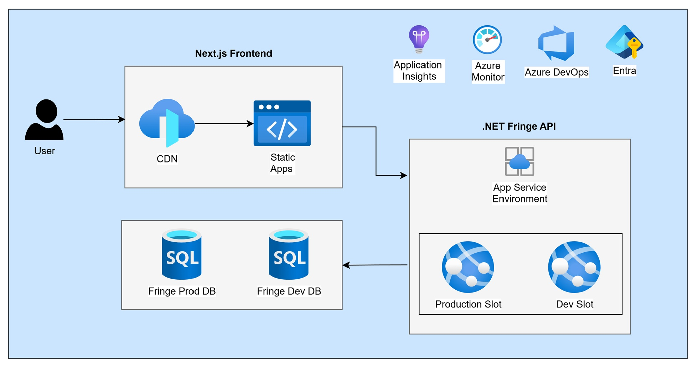
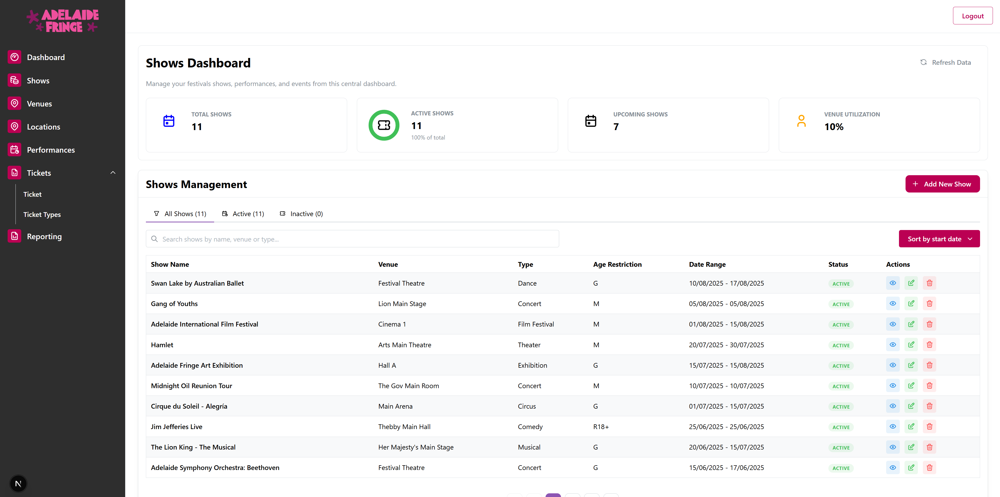

# 🎪 Fringe Festival Backend API

**RESTful API backend for Australia's largest arts festival management platform**

[](https://github.com/ndavidb/FringeFront)
[](https://dotnet.microsoft.com/download)
[](LICENSE)


## 🎯 Project Overview

A robust REST API built with .NET 8 and Entity Framework Core to manage festival events, bookings, and venues. Designed to integrate seamlessly with a React/Next.js frontend, providing a complete solution for festival management.

## Cloud Architecture overview


### Admin Dashboard

*Complete event management interface with real-time booking analytics*

### 🚀 Key Features

- **🔐 JWT Authentication** - Secure token-based authentication
- **🎭 Event Management** - Complete CRUD operations for festival events
- **🎫 Booking System** - Handle ticket bookings and availability
- **🏛️ Venue Management** - Manage multiple festival venues
- **👥 User Management** - Role-based access control (Admin/Customer)
- **📊 RESTful API** - Clean, consistent API design

### 🏗️ Architecture Overview


**Clean Architecture:** Separation of concerns with clearly defined layers for maintainability and testability.

## 💻 Tech Stack

| Category              | Technologies                           |
|-----------------------|----------------------------------------|
| **Framework**         | .NET 8 • C# 12 • ASP.NET Core          |
| **Data Access**       | Entity Framework Core 8                |
| **Database**          | SQL Server                             |
| **API Documentation** | Swagger/OpenAPI • Swashbuckle          |
| **Authentication**    | JWT Bearer Tokens                      |
| **Cloud**             | Azure App Service • Azure SQL Database |
| **Testing**           | NUnit • MOQ                            |

## 📐 Project Structure
      ├───Fringe.API
      │   ├───Controllers
      │   └───Properties
      ├───Fringe.DB
      │   ├───dbo
      │   │   └───Tables
      ├───Fringe.Domain
      │   ├───Configurations
      │   ├───DTOs
      │   │   ├───AuthDTOs
      │   │   ├───Booking
      │   │   ├───LocationDTOs
      │   │   ├───PerformanceDTOs
      │   │   ├───ShowDTOs
      │   │   ├───TicketDTO
      │   │   ├───TicketPriceDTOs
      │   │   ├───TicketTypeDTOs
      │   │   └───VenueDTOs
      │   ├───Entities
      │   ├───Enum
      │   ├───Extensions
      │   ├───Migrations
      │   ├───Models
      │   └───Seeders
      ├───Fringe.Repository
      │   ├───Repositories
      │   ├───Interfaces
      ├───Fringe.Service
      │   ├───Services
      │   ├───Interfaces
      └───Fringe.Tests
          ├───Repositories
          ├───Controllers
          ├───Services
## 🚀 Getting Started

### Prerequisites

- .NET 8 SDK
- SQL Server (local or Azure)
- Visual Studio 2022 or VS Code

### Installation & Setup

1. **Clone the repository**
   ```bash
   git clone https://github.com/ndavidb/FringeBackend.git
   cd FringeBackend
   ```
2. **Configure database connection**
   ```json
   {
     "ConnectionStrings": {
     "DefaultConnection": "Server=(localdb)\\mssqllocaldb;Database=FringeDB;Trusted_Connection=True;MultipleActiveResultSets=true"
     },
     "JwtSettings": {
     "Secret": "your-secret-key-at-least-32-characters-long",
     "Issuer": "FringeAPI",
     "Audience": "FringeClient",
     "ExpirationInMinutes": 60
     }
   }
   ```
3. **Run migrations**
   ```bash
    dotnet ef database update --project FringeDomain/FringeDomain.csproj --startup-project FringeApi/FringeApi.csproj
    ```
4. **Run the application**
   ```bash
   dotnet run --project FringeApi/FringeApi.csproj
   ```
5. **Access Swagger UI**
   Open your browser and navigate to `http://localhost:5000/swagger` to explore the API documentation.
## 📈 Performance Considerations

- **Entity Framework Query Optimization**
   - Use `AsNoTracking()` for read-only queries
   - Implement pagination for large datasets
   - Use projection to select only required fields

- **Caching Strategy**
   - Response caching for static data
   - In-memory caching for frequently accessed data

- **Database Performance**
   - Proper indexing on frequently queried columns
   - Stored procedures for complex operations

## 🔐 Security Implementation

- **Authentication & Authorization**
   - JWT Bearer token authentication
   - Role-based authorization (Admin, User)
   - Token expiration and refresh mechanism

- **Data Protection**
   - Input validation on all endpoints
   - SQL injection prevention via Entity Framework
   - HTTPS enforcement

## 📄 License

This project is licensed under the MIT License - see the [LICENSE](LICENSE) file for details.

## 📞 Contact

**David Bello** - Full Stack Developer

- 📧 Email: [david.bello2996@gmail.com](mailto:david.bello2996@gmail.com)
- 💼 LinkedIn: [linkedin.com/in/ndavidbello](https://linkedin.com/in/ndavidbello)
- 🐙 GitHub: [@ndavidb](https://github.com/ndavidb)

---

<div align="center">

*Built with ❤️ for the arts community in Adelaide, South Australia*

**[View Frontend Repository](https://github.com/ndavidb/FringeFront)**

</div>